#### .xcconfig

- 新增一个`Configuration`配置

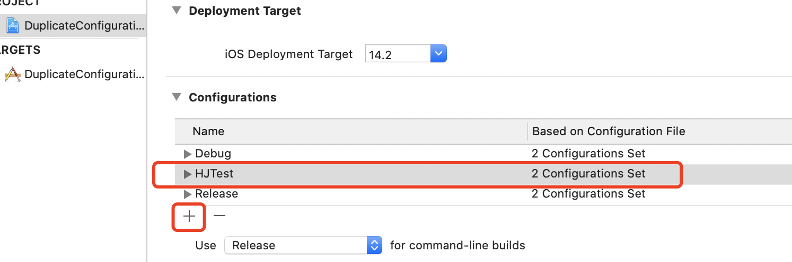

- 创建对应几个`xcconfig`文件

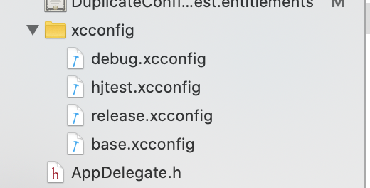

- 配置上

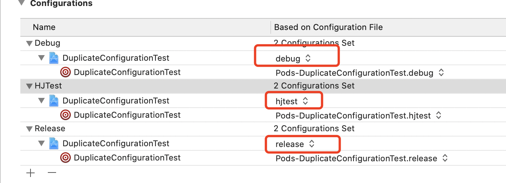

- 如果项目使用了`pod`，添加完配置记得先`pod install`一下，会自动生成`pod`相关的`xcconfig`

#### .xcconfig栗子

```objc
//引用对应的pod xcconfig
#include "Pods/Target Support Files/Pods-DuplicateConfigurationTest/Pods-DuplicateConfigurationTest.debug.xcconfig"
///引用 base
#include "base.xcconfig"

hj_ONLY_ACTIVE_ARCH = YES
hj_CFBundleVersion = 1.0.3

//预编译头参数 也可·Project -> Build settings -> Apple LLVM 7.1 - Preprocessing·设置
baseUrl = @"http:\/\/ly.api_debug.cn" //不同环境的server
GCC_PREPROCESSOR_DEFINITIONS = $(inherited) hjconfig=1 BaseUrl='${baseUrl}'

```

- 使用，通过`${key}` 设置

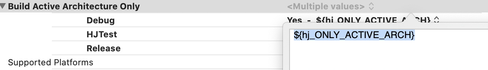

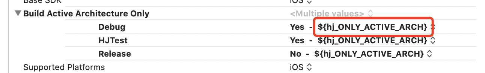


- 代码里使用**预编译头参数**

  - 预编译头参数可以通过上述`GCC_PREPROCESSOR_DEFINITIONS`方式
  - 也可自己配置手动加

  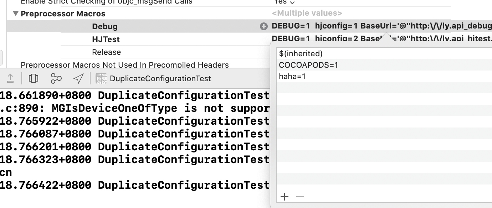

```objc
NSLog(@"%d", hjconfig);
    NSLog(@"%d",haha);
    NSLog(@"%@",BaseUrl);
    
    switch (hjconfig) {
        case 1:
            NSLog(@"debug");
            break;
        case 2:
            NSLog(@"hjtest");
            break;
        case 3:
            NSLog(@"release");
            break;
        default:
            break;
    }
```

- `xcconfig` 可以配置`buildSetting`里涉及到环境的所有选项

#### scheme

- 创建对应环境的`scheme`来方便切换跑代码，打包

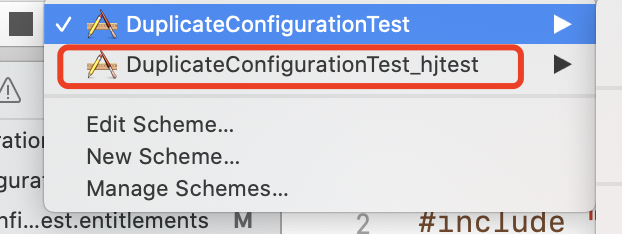

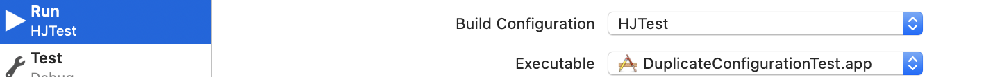

#### Settings.bundle(App的配置项)

- 创建`Settinngs.bundle `，名字不要改

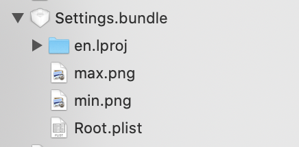


- 在`Root.plist`，配置，复制个模版`plist`修改，效果如下图

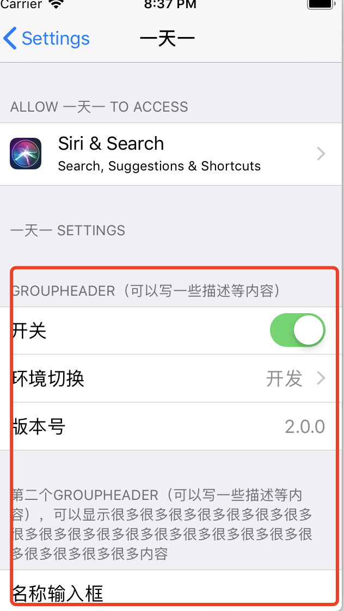

- `Settings.Bundle`支持六种配置项分别是：`Title，MultiValue，Group，Slider，ToggleSwitch，TextField `

##### Title

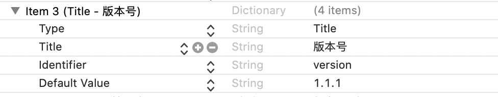

```
Type：配置类型，默认是Title
Title：配置项显示的Title
Identifier: 配置项的标识符，用来获取配置项的配置内容
Default Value :配置项默认值
```

##### MultiValue

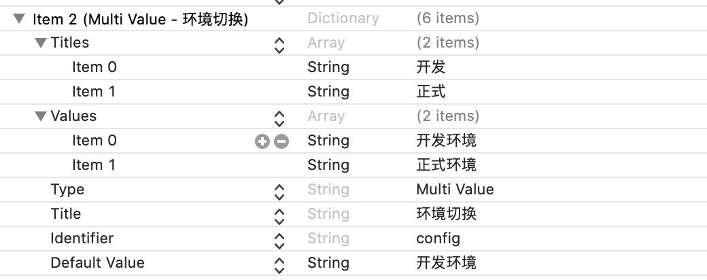

```
Type：配置类型，默认Multi Value
Title：配置项显示的标题
Identifier：配置项标识符，用来获取配置项的配置内容
Default Value：配置项默认值
Titles：显示的标题数组
Values：显示的值数组，与Titles一一对应
```

##### Group

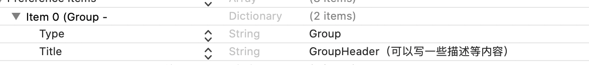

```
Type：配置类型，默认是Group
Title：配置项显示的Title
```

##### TextField

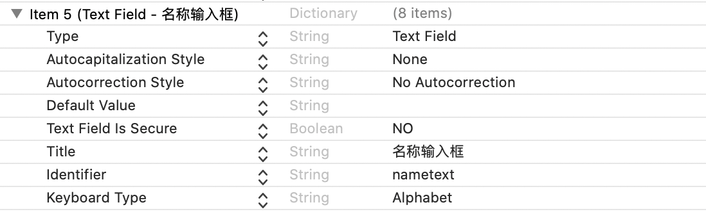

```
Type：配置类型，默认Text Field
Title：配置项显示的标题
Identifier：配置项标识符，用来获取配置项的配置内容
Default Value：配置项默认值
Text Field Is Secure：是否密文显示
KeyBoard Type：键盘类型
Autocapitalization Stylele：自动大写
Autocorrection Style：自动纠正拼写
```

##### ToggleSwitch

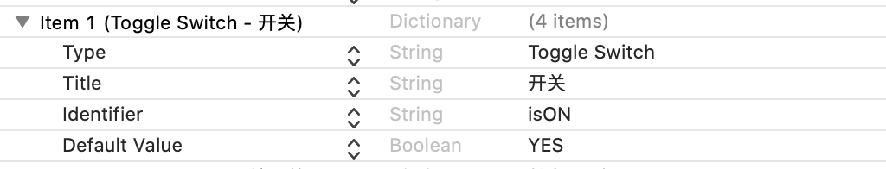

```
Type：配置类型，默认Toggle Switch
Title：配置项显示的标题
Identifier：配置项标识符，用来获取配置项的配置内容
Default Value：配置项默认值
```

##### Slider

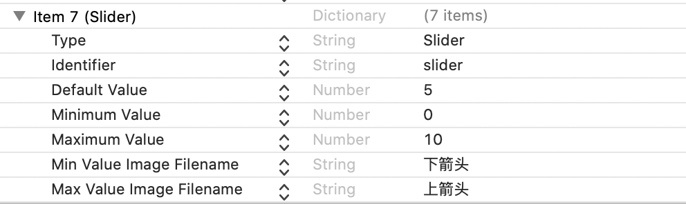

```
Type：配置类型，默认Slider
Identifier：配置项标识符，用来获取配置项的配置内容
Default Value：配置项默认值
Minimum Value：最小值
Maximun Value：最大值
Min Value Image Filename：最小值端图片
Max Value Image Filename：最大值端图片

图片尺寸21*21，放在Settings.bundle包内
```

##### app内获取配置信息

```
NSUserDefaults *userDefaults = [NSUserDefaults standardUserDefaults];
    
    NSLog(@"%ld",[[userDefaults objectForKey:@"isON"]integerValue]);
    NSLog(@"%@",[userDefaults objectForKey:@"config"]);
    NSLog(@"%@",[userDefaults objectForKey:@"version"]);
    NSLog(@"%@",[userDefaults objectForKey:@"nametext"]);
    NSLog(@"%@",[userDefaults objectForKey:@"passwordText"]);
    NSLog(@"%@",[userDefaults objectForKey:@"slider"]);
    
    self.settingsInfoLabel.text = [NSString stringWithFormat:@"isON:%ld\nconfig:%@\nversion:%@\nnametext:%@\npasswordText:%@\nslider:%@",[[userDefaults objectForKey:@"isON"]integerValue],[userDefaults objectForKey:@"config"],[userDefaults objectForKey:@"version"],[userDefaults objectForKey:@"nametext"],[userDefaults objectForKey:@"passwordText"],[userDefaults objectForKey:@"slider"]];
    
    if (![userDefaults objectForKey:@"config"]) {
         [userDefaults setObject:@"开发环境" forKey:@"config"];
    }
    /*运行应用后直接直接通过上面的代码获取信息，你会得到null；原因是：
     root.plist实际上只是一个静态文件用来在设置里显示；只有当你对它进行修改，
     它才会往NSUserDefaults里添加。修改配置后，NSUserDefaults的优先级高于root.plist文件。
     */
    ///也可设值 , 首次打开app没有值可以设一下
    [userDefaults setObject:@"2.0.0" forKey:@"version"];
```

